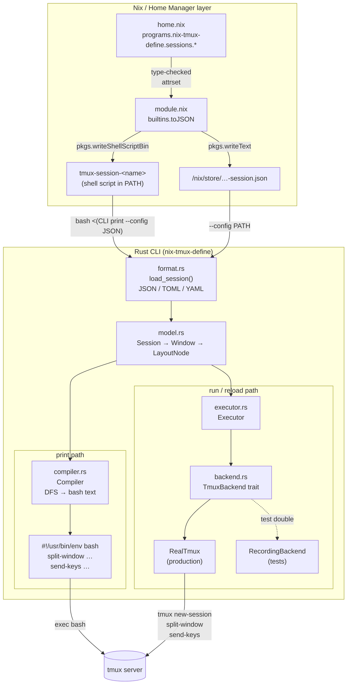

# nix-tmux-define

[](https://github.com/takeokunn/nix-tmux-define/actions/workflows/ci.yml)
[](LICENSE)

**Declarative, type-safe tmux session manager powered by Nix + Rust.**

Define your tmux workspace once in Nix (or JSON) and reproduce it instantly — no Python runtime, no mutable state, no drift.

---

## Why nix-tmux-define?

| | tmuxp / tmuxinator | Pure Nix | **nix-tmux-define** |
|---|---|---|---|
| Runtime dependency | Python / Ruby | Nix evaluator | **Rust binary only** |
| Config language | YAML / Ruby | Nix attrsets | **Nix → JSON → Rust** |
| Recursive layouts | Limited | Complex to compute | **Tree → DFS → bash** |
| Home Manager integration | Manual | N/A | **Native HM module** |
| Reproducibility | ✗ | ✓ | **✓** |

### Architecture



The Rust CLI has **two execution paths**:

- **`print` path** — `Compiler` performs a two-phase depth-first traversal of the `LayoutNode` tree, emitting all `split-window` calls first (structure phase), then all `send-keys` / `select-pane` calls (command phase). The Home Manager module wraps this with `bash <(…)` process substitution.
- **`run` / `reload` path** — `Executor` drives tmux directly via the `TmuxBackend` trait, bypassing the bash script entirely. `RecordingBackend` implements the same trait for unit tests without spawning a real tmux.

This guarantees every pane is ready before any command is dispatched.

---

## Quick Start

### Try without installing

```bash
nix run github:takeokunn/nix-tmux-define -- print --config ./session.json
```

### Add to your flake

```nix
# flake.nix
{
  inputs = {
    nixpkgs.url        = "github:NixOS/nixpkgs/nixos-unstable";
    home-manager.url   = "github:nix-community/home-manager";
    nix-tmux-define.url = "github:takeokunn/nix-tmux-define";
  };

  outputs = { home-manager, nix-tmux-define, ... }: {
    homeConfigurations."you@host" = home-manager.lib.homeManagerConfiguration {
      modules = [
        nix-tmux-define.homeManagerModules.default
        ./home.nix
      ];
    };
  };
}
```

### Configure in `home.nix`

```nix
programs.nix-tmux-define = {
  enable = true;

  sessions.dev = {
    name = "dev";
    root = "~/src/myproject";

    windows = [
      {
        name   = "main";
        layout = {
          type      = "split";
          direction = "horizontal";
          ratio     = 0.6;                     # left pane gets 60%
          first  = { type = "pane"; command = "nvim ."; focus = true; };
          second = {
            type      = "split";
            direction = "vertical";
            ratio     = 0.5;
            first  = { type = "pane"; command = "cargo watch -x check"; };
            second = { type = "pane"; command = "git status"; title = "git"; };
          };
        };
      }
      {
        name   = "logs";
        layout = { type = "pane"; command = "journalctl -f"; };
      }
    ];

    env = [
      { key = "EDITOR"; value = "nvim"; }
    ];
  };
};
```

After `home-manager switch`, a `tmux-session-dev` command appears in your PATH:

```bash
tmux-session-dev            # create session (or reattach if it exists)
tmux-session-dev --reload   # kill tmux server, then create a fresh session
tmux-session-dev -r         # shorthand for --reload
```

### Dynamically generating sessions

Because `sessions` is a plain Nix `attrsOf`, you can generate entries with `map` and `lib.listToAttrs`:

```nix
let
  profiles = [
    { name = "api";     root = "~/src/api"; }
    { name = "frontend"; root = "~/src/frontend"; }
  ];
in {
  programs.nix-tmux-define.sessions =
    lib.listToAttrs (map (p: lib.nameValuePair p.name {
      name = p.name;
      root = p.root;
      windows = [{
        name   = "main";
        layout = { type = "pane"; command = "nvim ."; focus = true; };
      }];
    }) profiles);
}
```

---

## JSON Config Reference

The Rust CLI accepts a JSON file that maps 1:1 to the Nix schema above.

### Session

```jsonc
{
  "name":     "dev-session",          // tmux session name (required)
  "root":     "/home/user/src/proj",  // default working dir (optional)
  "env":      [{ "key": "K", "value": "V" }],  // session-level exports
  "pre_hook": "nix build",            // runs before new-session
  "options":  { "status": "off" },    // tmux set-option key/value pairs
  "vars":     { "proj": "/home/user/src" },     // template variables
  "windows":  [ /* Window[] */ ]
}
```

### Window

```jsonc
{
  "name":          "main",
  "root":          "/override",   // overrides session root for this window
  "env":           [],            // window-scoped exports
  "options":       { "synchronize-panes": "on" },  // tmux set-window-option
  "select_layout": "tiled",       // apply a tmux layout preset (optional)
  "layout":        /* LayoutNode */
}
```

### LayoutNode — Pane (leaf)

```jsonc
{
  "type":     "pane",
  "command":  "nvim .",     // sent via send-keys (optional)
  "focus":    true,         // move focus here after setup (default: false)
  "title":    "editor",     // select-pane -T (optional)
  "wait_for": {             // block until pattern appears in pane output
    "pattern": "ready",
    "timeout": 30           // seconds (default: 30)
  }
}
```

### LayoutNode — Split (branch)

```jsonc
{
  "type":      "split",
  "direction": "horizontal",  // "horizontal" | "vertical"
  "ratio":     0.6,           // first child gets 60%, second gets 40%
  "first":     { /* LayoutNode */ },
  "second":    { /* LayoutNode */ }
}
```

> **`direction` semantics**
> - `horizontal` → side-by-side panes (`split-window -h`)
> - `vertical`   → top/bottom panes (`split-window -v`)

### Template variables

Use `{{key}}` placeholders in `command` and `root` values.
Built-in variables are always available:

| Placeholder | Expands to |
|---|---|
| `{{cwd}}` | `$PWD` at session-start time |
| `{{date}}` | `$(date +%Y-%m-%d)` |
| `{{git_branch}}` | `$(git rev-parse --abbrev-ref HEAD)` |

User-defined variables go in the `vars` map at session level.

### Full example

```json
{
  "name": "dev-session",
  "root": "/home/user/src/project",
  "env":  [{ "key": "EDITOR", "value": "nvim" }],
  "windows": [
    {
      "name": "main",
      "layout": {
        "type": "split", "direction": "horizontal", "ratio": 0.6,
        "first":  { "type": "pane", "command": "nvim .", "focus": true, "title": "editor" },
        "second": {
          "type": "split", "direction": "vertical", "ratio": 0.5,
          "first":  { "type": "pane", "command": "cargo watch -x check" },
          "second": { "type": "pane", "command": "git log --oneline" }
        }
      }
    },
    {
      "name": "shell",
      "layout": { "type": "pane" }
    }
  ]
}
```

---

## CLI Reference

```
nix-tmux-define <COMMAND>

Commands:
  run          Start a tmux session from a config file
  print        Print the generated bash script to stdout (dry-run)
  reload       Kill and re-create a session from a config file
  validate     Parse a config and report errors
  list         List all sessions from config files
  schema       Print the JSON Schema for the session config format
  completions  Emit shell completion scripts

Options:
  -h, --help     Print help
  -V, --version  Print version
```

### `run`

```
nix-tmux-define run --config <PATH> [--kill-server]

Options:
  --config <PATH>   Path to the session config (JSON, TOML, or YAML)
  -k, --kill-server Kill the tmux server before creating the session
                    (wipes all sessions, then creates this one fresh)
```

### `reload`

```
nix-tmux-define reload --config <PATH>
```

Kills only the named session, then recreates it. Use `run --kill-server` to wipe the entire server first.

### Examples

```bash
# Dry-run — inspect the generated script
nix-tmux-define print --config session.json

# Create session (or reattach if already running)
nix-tmux-define run --config session.json

# Wipe all tmux sessions, then create this one fresh
nix-tmux-define run --config session.json --kill-server

# Kill only this session and recreate it
nix-tmux-define reload --config session.json

# Validate config without touching tmux
nix-tmux-define validate --config session.json

# List sessions in current directory
nix-tmux-define list

# Install fish completions
nix-tmux-define completions fish > ~/.config/fish/completions/nix-tmux-define.fish
```

### Idempotency & nested tmux

The generated script is always idempotent:

```bash
if tmux has-session -t "$SESSION" 2>/dev/null; then
  if [ -n "${TMUX:-}" ]; then
    exec tmux switch-client -t "$SESSION"   # already inside tmux
  else
    exec tmux attach-session -t "$SESSION"  # fresh terminal
  fi
fi
```

Running `tmux-session-dev` twice never creates a duplicate; it just reattaches.

---

## Development

```bash
# Enter the dev shell (provides cargo, rustc, rust-analyzer, tmux)
nix develop

# Run tests
cargo test

# Run clippy
cargo clippy

# Build the release binary via Nix
nix build

# Check all outputs (runs cargo test in a pure sandbox)
nix flake check
```

### Project layout

```
nix-tmux-define/
├── src/
│   ├── lib.rs        # public API surface
│   ├── main.rs       # CLI entry point (clap subcommands)
│   ├── model.rs      # Session / Window / LayoutNode types + serde
│   ├── compiler.rs   # Compiler: Session → bash script (print path)
│   ├── executor.rs   # Executor: Session → live tmux calls (run path)
│   ├── backend.rs    # TmuxBackend trait + RealTmux + RecordingBackend
│   └── format.rs     # load_session(): JSON / TOML / YAML deserialization
├── flake.nix         # packages, apps, devShell, checks, homeManagerModules
├── module.nix        # Home Manager option definitions
└── Cargo.toml
```

---

## Contributing

Bug reports and pull requests are welcome.

1. Fork the repository
2. `nix develop` to enter the dev shell
3. Make changes and add tests
4. `cargo test && cargo clippy` must pass
5. Open a PR — CI runs `nix flake check` automatically

---

## License

[MIT](LICENSE) © takeokunn
